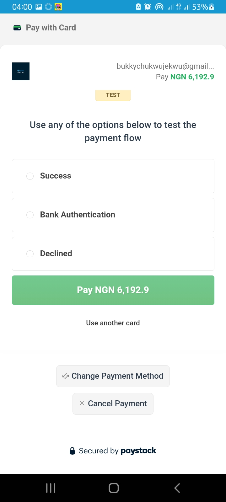

# Paystack Webview Android
The Android library that helps developers integrate Paystack's payment gateway with just few lines of code.

## Screenshots

Paystack Quick test  | Pay With Card  
 :-------------------------:|:-------------------------:
  |    |


## How to Use
- Add Jitpack to your gradle file:
    - For older projects, open up the app level build.gradle file and add jitpack as shown
      ``` java
      allprojects {
      repositories {
      ......
      maven { url 'https://jitpack.io' }
          }
       }
      ```
  
    - For more recent versions of Android studio, open up settings.gradle file in your project and add Jitpack as shown
      ``` java
      dependencyResolutionManagement {
      repositoriesMode.set(RepositoriesMode.FAIL_ON_PROJECT_REPOS)
      repositories {
      .......
      maven { url 'https://jitpack.io' }
          }
       }
      ```


- Add Dependency to your app level build.gradle file
  
  ``` java
  dependencies {
	        implementation 'com.github.VhiktorBrown:Paystack-webview-android:1.0.5'
  }
  ```

- After adding these, sync your project With Gradle files.


## Code Implementation

- In your Activity, copy and paste this code and fill in your own values.
  
  ``` java
    new PayStackWebViewForAndroid(this)
                    .setAmount(amount)
                    .setEmail(email)
                    .setSecretKey(secret_key)
                    .setCallbackURL(call_back_url)
                    .showProgressBar(progress)
                    .setMetaData(metaData)
                    .initialize();
  ```


- Adding/Filling in your own values will look somewhat like this:

  ``` java
    new PayStackWebViewForAndroid(this)
                    .setAmount(60000)
                    .setEmail("customer@gmail.com")
                    .setSecretKey("sk_22563jddcb722633638")
                    .setCallbackURL("https://mywebsite/call-back-url")
                    .showProgressBar(false)
                    .setMetaData(orderDetails)
                    .initialize();
  ```


- Add this line of code in the same Activity(outside the onCreate() method) to know if payment was successful or not.

``` java
@Override
    protected void onActivityResult(int requestCode, int resultCode, Intent data) {


         /* After payment if successful, you'll get the Reference and Access code
         * that was used to make payment. You should send this reference code to
         * your backend/server to confirm payment and get the goods or service
         * that you sent before user made payment.


         * Paystack allows you to send the goods or service that your user
         * is attempting to make payment for. So that after payment has been
         * successful, all you need to do is send the reference that the user
         * made payment with to your backend, and then your backend with that
         * reference can get back those goods and services from Paystack.
          */


        if(requestCode == PayStackWebViewConstants.REQUEST_CODE && data != null){
            if(resultCode == PayStackWebViewConstants.RESULT_SUCCESS){
                //Get the 'reference' and send to your backend for confirmation before you provide goods or services.
                String accessCode = data.getStringExtra(PayStackWebViewConstants.ACCESS_CODE);
                String reference = data.getStringExtra(PayStackWebViewConstants.REFERENCE);

            }else if(resultCode == PayStackWebViewConstants.RESULT_CANCELLED){
                //do something/take action if payment was cancelled or unsuccessful
            }
        }else {
            super.onActivityResult(requestCode, resultCode, data);
        }
    }
```

- More details of data required, importance,etc.

Argument | Type & Details
 ------------ | ------------- 
this | Activity or Fragment.
amount | Double data type. REQUIRED. <br/> Make sure to convert into Kobo before passing it as an argument. For example, a transaction of 600 naira should be multiplied by 100(600 * 100) to give 60000 kobo.
email | String data type. REQUIRED. <br/> This is the email of the customer making the payment.
secret_key | String data type. REQUIRED. <br/> This is your secret key gotten from your Paystack dashboard. Make sure you change your keys to your live keys before pushing to production.
call_back_url | String data type. REQUIRED. <br/> Get your call_back_url from your Paystack's dashboard. If you've not added it, do so from your paystack dashboard.
progress | boolean data type. OPTIONAL. <br/> If set to true, shows a progress bar to your customer to let them know that something is happening in the background and if in any case, there is internet connectivity error, it shows them a button to allow them turn on their internet and initialize the transaction again.
metaData | Any class instance that holds the data of the goods or service your customer wants to make payment for OPTIONAL. <br/> You can choose to send the goods or service your customer wants to buy to Paystack's server. Paystack saves it for you so that after confirming payment, you can retrieve it and supply these goods ot service to your customer from your backend/server.
initialize() | starts the process of initializing payment.


## License
```text
Copyright 2023 The Elite Developers

Licensed under the Apache License, Version 2.0 (the "License");
you may not use this file except in compliance with the License.
You may obtain a copy of the License at

   http://www.apache.org/licenses/LICENSE-2.0

Unless required by applicable law or agreed to in writing, software
distributed under the License is distributed on an "AS IS" BASIS,
WITHOUT WARRANTIES OR CONDITIONS OF ANY KIND, either express or implied.
See the License for the specific language governing permissions and
limitations under the License.
```